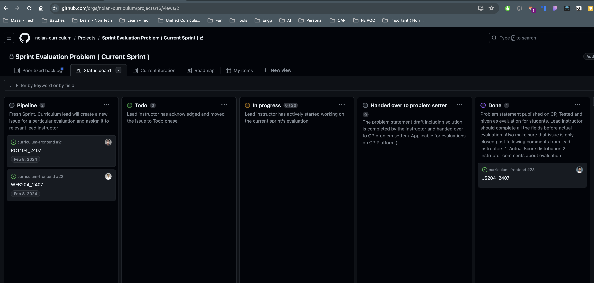

1. Ensure each sprint's evaluation primarily assesses the specific learning objectives for that sprint. At least 70% of the total score should reflect these objectives, aligning the evaluation with the intended learning outcomes.

2. The evaluation instructions must be crystal clear, leaving no room for confusion. Your question should include:

   - **Overview** :

     - Example :

     ```plaintext
         > Assess the developer's grasp of State management in React and the useState hook.
         > The task involves building a React counter application using the `useState` hook,
         > starting with a count value of 0 and
         > a button that increments the count by 1 upon each click.
     ```

   - **Topics** :

     - List all topics covered in the evaluation to ensure participants are aware of the assessment's scope.

   - **Setup Guidelines and Instructions** : Offer a step-by-step guide, for instance:

     - Example :

       - **Create a New Vite Project**:

         - Open your terminal.
         - Run `npm create vite@latest <name-of-app> -- --template react`to create a new project.
         - Navigate into the project directory using `cd <name-of-app>`.

       - **Install Dependencies**:

         - Inside your project directory, run `npm install` to install necessary dependencies.

       - **Start the Development Server**:

         - Run `npm run dev` to start the Vite development server.
         - Open `http://localhost:5173` in your browser to see your project.

   - **Rubrics** : Clearly define the rubrics, outlining the distribution for each evaluated component.

     - Example :
       ```markdown
       ✅ function calculateAverageExamScore must return correct average Exam Score [2]
       ✅ function findTopScorer must return the correct highest average exam score [2]
       ✅ function combiningArrays must return correct groceries array [2]
       ✅ function mergingObjects must return correct aspiring developersWithCourse object-1 [1]
       ✅ function findFrequency must return correct object with the frequency of iceCream in superheroIceCreamData [3]
       ```

   - **Problem Statement** :

     - Clearly define the problem, detailing every task/feature the aspiring developer is expected to complete. Ensure the statement is thorough and leaves no room for misunderstanding.
     - Include all necessary details, such as API specifications. All the important details wrt problem statement and it's dependencies comes under this sections

   - **Submission guidelines** :

     - Clearly state all submission-related guidelines in this section.
     - Avoid creating multiple subsections like General Guidelines, Misc Guidelines, Notes, etc. All guidelines should be categorized under Setup, Problem Statement, or Submission sections as appropriate.
     - Ensure every detail regarding the submission process is mentioned, including steps like pushing the code to GitHub and submitting the repository link on CP. Do not make any assumptions and clearly define instructions. Each problem should contain all necessary submission details.

3. The lead instructor is responsible for ensuring the evaluation problem on the CP platform follows these guidelines. They must review the problem statement, rubrics, and functionality on the CP platform, making sure everything is correct before the final approval.

4. When designing rubrics for consistent grading, consider the following metrics to gauge the participants' understanding and mastery of the learning objectives ( Total should sum up to 10 ):

   - **Score below 4**: Shows a lack of understanding or poor performance. (Below Threshold)
   - **Score between 4 and less than 7**: Shows basic understanding but not full mastery. The performance is adequate. (At Threshold)
   - **Score between 7 and 10**: Shows a strong understanding and application of the learning objectives. (Above Threshold)

5. Collaboration on evaluation setting involves using a GitHub project named "Sprint Evaluation Problem (Current Sprint)". This project facilitates tracking related tasks.



6.  The process within the GitHub project is structured as follows:

    1.  **Pipeline** : The curriculum lead initiates a new issue for the evaluation and assigns it to the relevant lead instructor.
    2.  **Todo** : The lead instructor acknowledges and moves the issue to the Todo phase.
    3.  **In Progress** : The lead instructor starts working on the current sprint's evaluation.
    4.  **Handed over to problem setter** : After completing the problem statement draft and solution, the instructor hands it over to the CP problem setter (for evaluations on the CP Platform).
    5.  **Done** : After publishing the problem statement on CP, testing it, and using it for student evaluations, this phase is reached.

        1. The lead instructor must fill out all required fields on the GitHub project card before the actual evaluation, ensuring all necessary details are provided and clear.
           1. Course Name
           2. Sprint
           3. Evaluation Platform
           4. Distribution of Scores in Percentages (1-4) (Total adds up to 100%)
           5. Distribution of Scores in Percentages (4-7) (Total adds up to 100%)
           6. Distribution of Scores in Percentages (7-10)(Total adds up to 100%)
           7. Evaluation Link
           8. Is this a new question prepared for this block? (Yes/No)
           9. Learning Objectives Assessed in this Evaluation (Separate with commas if multiple).
           10. Instructor's Time to Solve this Problem/Contest (in minutes)
           11. Duration Allotted to Students (in minutes)
        2. Post-evaluation, the instructor should also provide
           1. Actual score distribution in the format :
              1. Distribution of Scores in Percentages (1-4) (Total adds up to 100%)
              2. Distribution of Scores in Percentages (4-7) (Total adds up to 100%)
              3. Distribution of Scores in Percentages (7-10)(Total adds up to 100%)
           2. Comments regarding the evaluation, including any discrepancies between expected and actual score distributions, explanations for these discrepancies.Basically any conducted root cause analysis (RCA).
