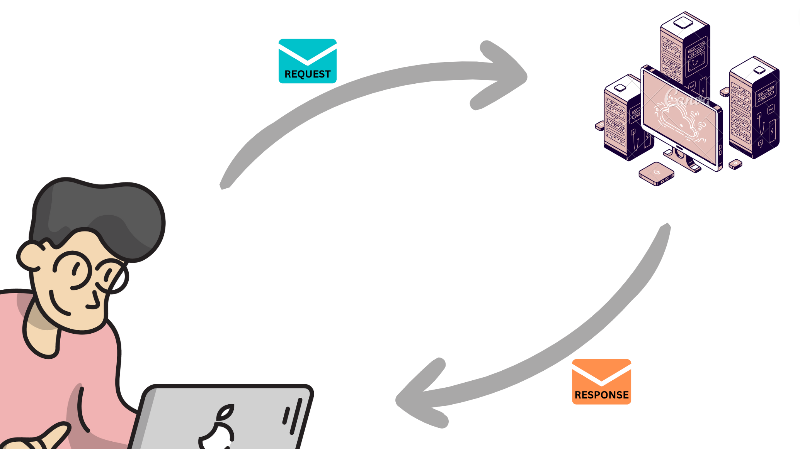
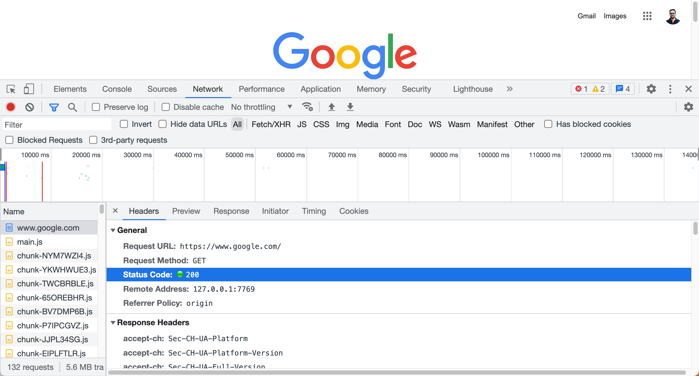

# Fetch-I:

## Sample Lecture Link

- [Previous Session's Lecture on Fetch-I]()


## Client / Server model - Quick refresher



Explore the network tab of the dev tools by browsing 

- [https://www.google.com/](https://www.google.com/)
- [https://jsonplaceholder.typicode.com/users](https://jsonplaceholder.typicode.com/users)
- [https://reqres.in/api/users?page=2](https://reqres.in/api/users?page=2)


Fetch analogy:  [https://www.canva.com/design/DAFnskZ65Jc/-mM86FytMXZHEGEVFnHjFQ/edit?utm_content=DAFnskZ65Jc&utm_campaign=designshare&utm_medium=link2&utm_source=sharebutton](https://www.canva.com/design/DAFnskZ65Jc/-mM86FytMXZHEGEVFnHjFQ/edit?utm_content=DAFnskZ65Jc&utm_campaign=designshare&utm_medium=link2&utm_source=sharebutton)


## Self study

- Status Codes
    
    
 ---   

### What is `fetch()`?

`fetch()` is a modern way in JavaScript to make network requests, like fetching data from a server or sending data to one. . 

### Basic Structure:

```jsx
fetch("<https://api.example.com/user-details>")// This is the URL you're "calling"
  .then(function (response) {
    return response.json()// Convert the response to a format we can easily work with.
  })
  .then(function (data) { // so the returned value of the previous called is available now here as function argument
    console.log(data) // Do something with the data
  })
  .catch(function (error) {
    console.error("Error:", error) // If something goes wrong, this block will run.
  })
```

With the basic structure we've discussed, you can start making simple requests and handle the data they return. As you become more familiar with it, you'll discover even more capabilities and options it offers.

### Breaking it Down:

1. **URL:** The URL inside `fetch('<https://api.example.com/data>')` is the web address we want to get data from or send data to.
2. **.then() Method:** Think of `.then()` as the next step in a sequence. It's used because network operations can take time, so JavaScript doesn't want to just sit around waiting. Instead, it says, "When you're done getting that data, *then* do this next thing."
3. **response => response.json():** When the server gives us back data, it's often not in a format that's easy for JavaScript to work with immediately. So, we convert it into a "JavaScript-friendly" format called JSON.
4. **data => { ... }:** Now that we have our data in a format we can use, we define what to do with it. For simplicity, we're just logging it to the console in this example.
5. **.catch() Method:** Sometimes, things go wrong. Maybe the server is down, or we made a typo in the URL. The `.catch()` method lets us handle any errors gracefully, meaning our entire script won't crash.

### Notes:

- `fetch()` returns  a "Promise"
- The beauty of `fetch()` is that it's part of modern JavaScript, so you don't need any additional libraries or tools to use it.

---

As a frontend developer, your task is to retrieve data from the backend (the storage room) and show it on the frontend (the display). This data is managed by backend developers, and they provide specific instructions on how to access it.

These instructions are called **API documentation**. It's like a guidebook written by the backend team to help frontend developers know the right way to ask for data. So different Products. Different API, Different API Documentations. It’s like different machines that you have in your house like washing machine, refrigerator etc having different user manual. You read that particular machine’s user manual ( API Documentation ) to understand about that machine ( API )  

Using the `fetch` function in JavaScript, you can follow these instructions to request data from the backend. Once you have the data, you can display it in your application. This means your application is now not just a standalone app but is connected to a backend server, pulling real data to show to users.

So our agenda in this particular session is to 

1. Explore some API documentations
2. Use fetch API and build some application which makes network request to the server and use the response and display the same onto UI.
3. We will also see a cool tool called Local Storage and how it can be useful


## Instructor Activity | Code Implementation | Examples


### Example 

API DOCS :

[Fake Store API](https://fakestoreapi.com/docs)

index.html

```html
<!DOCTYPE html>
<html lang="en">
  <head>
    <meta charset="UTF-8" />
    <meta http-equiv="X-UA-Compatible" content="IE=edge" />
    <meta name="viewport" content="width=device-width, initial-scale=1.0" />
    <style>
      #container {
        display: grid;
        grid-template-columns: repeat(4, 1fr);
        margin-top: 5%;
        margin-left: 5%;
        margin-right: 5%;
        grid-gap: 20px;
      }

      #container > div {
        display: flex;
        flex-direction: column;
        align-items: center;
        justify-content: center;
        border: 1px solid #cecece;
      }

      img {
        width: 90%;
        height: 225px;
      }
    </style>
    <title>E Commerce</title>
  </head>
  <body>
    <h1>E Commerce</h1>
    <div id="container"></div>
  </body>
  <script src="index.js"></script>
</html>
```

index.js


```jsx

    let container = document.getElementById("container");

    let data = [];

    // get the data
    fetch("https://fakestoreapi.com/products")
      .then(function (res) {
        return res.json();
      })
      .then(function (res) {
        displayData(res);
      });

    function displayData(data) {
      data.forEach(function (product) {
        let div = document.createElement("div");

        let productImg = document.createElement("img");

        productImg.src = product.image;

        let title = document.createElement("p");

        title.innerText = product.title;

        let price = document.createElement("p");

        price.innerText = "INR : " + product.price;

        div.append(productImg, title, price);

        container.append(div);
      });
    }
```


## Student Activities

---

### Example 

API Docs :

[Reqres - A hosted REST-API ready to respond to your AJAX requests](https://reqres.in/)

index.html

```html
<!DOCTYPE html>
<html lang="en">
  <head>
    <meta charset="UTF-8" />
    <meta http-equiv="X-UA-Compatible" content="IE=edge" />
    <meta name="viewport" content="width=device-width, initial-scale=1.0" />
    <style>
      #container {
        display: grid;
        grid-template-columns: repeat(4, 1fr);
        margin-top: 5%;
        margin-left: 5%;
        margin-right: 5%;
        grid-gap: 20px;
      }

      #container > div {
        display: flex;
        flex-direction: column;
        align-items: center;
        justify-content: center;
        border: 1px solid #cecece;
      }

      img {
        width: 90%;
        height: 225px;
      }
    </style>
    <title>Reqres</title>
  </head>
  <body>
    <h1>Get Dummy Users data</h1>
    <div id="container"></div>
  </body>
</html>
<script src='index.js'></script>

```

index.js

```jsx
      let container = document.getElementById("container");

      let data = [];

      // get the data
      fetch("https://reqres.in/api/users") //fetch is a promise and promises takes time
        .then(function (res) {
          return res.json();
        })
        .then(function (res) {
          data = res.data;
          console.log("data:", data);
          displayData(data);
        });

      function displayData(data) {
        data.forEach(function (user) {
          let div = document.createElement("div");

          let avatar = document.createElement("img");

          avatar.src = user.avatar;

          let name = document.createElement("p");

          name.innerText = `${user.first_name} ${user.last_name}`;

          let email = document.createElement("p");

          email.innerText = user.email;

          div.append(avatar, name, email);

          container.appendChild(div);
        });
      }
```

---

## Conclusion

- This session covered the client/server model and the practical use of the fetch API in JavaScript. We learned how to structure fetch requests, handle responses, and explored real-world examples fetching data from the Fake Store API and Reqres. The importance of API documentation for effective frontend-backend communication was emphasized. Fetch() emerged as a crucial tool for frontend developers, connecting applications to backend servers and dynamically displaying real data, making it a versatile and essential part of modern web development.

## Resources - Official Documentation and Other Resources

API Docs :

- [Fake Store API](https://fakestoreapi.com/docs)

- [Reqres - A hosted REST-API ready to respond to your AJAX requests](https://reqres.in/)

---

# Async-Await :

### Async Await

**`async/await`** is a modern way to handle asynchronous operations in JavaScript. It allows you to write asynchronous code that looks and behaves like synchronous code, making it easier to read and understand.

Quick Recap : **What’s an async operation ?**

In JavaScript, certain operations (like fetching data from a server) don't complete immediately. Instead of blocking the rest of the code from running, JavaScript continues executing the next lines of code. This is where **`async/await`** comes into play, helping us manage these operations more intuitively.

## Instructor Activity | Code Implementation | Examples

**Live Coding Session: Understanding Async Functions**  
  We'll write async functions, use the await keyword, and handle asynchronous operations without callback hell.


Fetch operation using `.then` and `.catch`

```jsx
function fetchUserData(url) {
    fetch(url) // We start by calling the fetch function, which returns a Promise.
        .then(response => { // We use .then() to handle the successful response.
            return response.json(); // If the response was successful, we return the parsed JSON data using response.json(), which itself returns a Promise.
        })
        .then(data => { // We chain another .then() to handle the parsed JSON data.
            console.log(data);
        })
        .catch(error => { // Finally, we use .catch() to handle any errors that might occur during the fetch or the parsing process.
            console.error("Error fetching data:", error);
        });
}

fetchUserData('https://api.example.com/users'); // 
```

Fetch operation using `async` and `await`

```jsx
async function fetchUserData(url) {
    try {
        let response = await fetch(url);
        let data = await response.json();
        console.log(data);
    } catch (error) {
        console.error("Error fetching data:", error);
    }
}

fetchUserData('https://api.example.com/users');
```

**Summary :**

- **`async/await`** provides a cleaner way to handle asynchronous operations in JavaScript.
- It works hand-in-hand with Promises, making the code look synchronous while still being asynchronous.
- The **`fetch`** API, combined with **`async/await`**, offers a straightforward way to handle network requests.


**Example :**
- fetch the data using fakestoreapi api 
    - Arrow Functions used
    - Async Await
    
    ```jsx
    // index.html
    <!DOCTYPE html>
    <html lang="en">
      <head>
        <meta charset="UTF-8" />
        <meta http-equiv="X-UA-Compatible" content="IE=edge" />
        <meta name="viewport" content="width=device-width, initial-scale=1.0" />
        <style>
          #main {
            width: 80%;
            margin: auto;
            display: grid;
            grid-template-columns: repeat(3, 1fr);
            grid-gap: 20px;
          }
    
          .product-card {
            display: flex;
            flex-direction: column;
            align-items: center;
            justify-content: center;
            border: 1px solid #cecece;
            padding: 10px;
          }
    
          .product-card img {
            height: 200px;
            width: 200px;
          }
        </style>
        <title>E Commerce</title>
      </head>
      <body>
        <div id="main"></div>
      </body>
      <script src="index.js"></script>
    </html>
    ```
    
    ```jsx
    // index.js
    let main = document.getElementById("main")
    let URL = `https://fakestoreapi.com/products`
    
    const init = async () => {
      try {
        let res = await fetch(URL)
        let data = await res.json()
        displayData(data)
      } catch (error) {
        console.log(error)
      }
    }
    init()
    
    const displayData = (data) => {
      data.forEach(function (product) {
        let productCard = document.createElement("div")
        productCard.className = "product-card"
    
        let productImg = document.createElement("img")
        productImg.src = product.image
    
        let title = document.createElement("p")
        title.innerText = product.title
    
        let price = document.createElement("p")
        price.innerText = "INR : " + product.price
    
        productCard.append(productImg, title, price)
    
        main.append(productCard)
      })
    }
    ```
    

## Student Activities

- Exercise 1: Implementing Async Function
Write an async function that simulates fetching data using 'https://reqres.in/api/users' API. Log the result or handle errors using try-catch.

## Conclusion

- In conclusion, async and await provide a more natural way to work with asynchronous JavaScript, making code cleaner and easier to understand. Asynchronous programming is vital in building responsive and efficient applications, and mastering async/await will greatly benefit your JavaScript development skills.

## Resources - Official Documentation and Other Resources

MDN Web Docs - [async function](https://developer.mozilla.org/en-US/docs/Web/JavaScript/Reference/Statements/async_function)

MDN Web Docs - [await](https://developer.mozilla.org/en-US/docs/Web/JavaScript/Reference/Operators/await)

